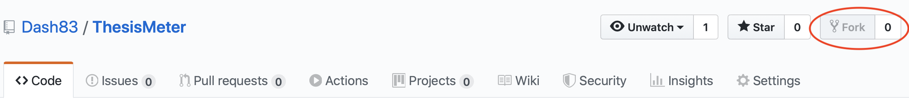
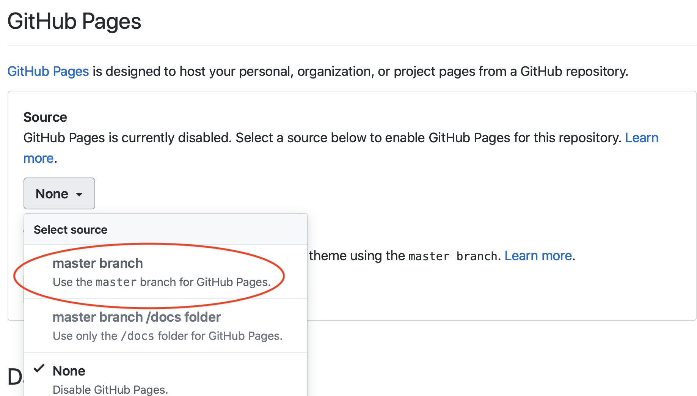
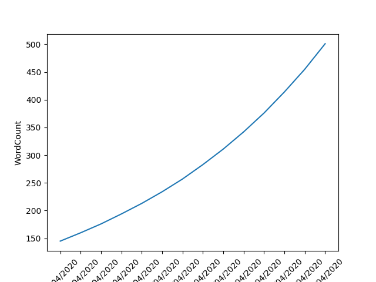

# ThesisMeter
As it is traditional among PhD students that have to write-up their thesis, I am going through the ceremonial process of procrastinating through the building of a tool that tracks my thesis-writing process. I figured since I was already doing this, I would make it available for other students with minimal effort.

A very good question would be: Why would I want to have that? Plenty of answers come to mind:

* Setting it up feels like you are working, but you are not!
* It helps you keep track of your own progress.
* It helps you to keep yourself accountable by making your progress public.
* You can make it fun by having your classmates set it up as well and compete on who makes the most progress, if you are into that sort of thing.

If you do decided to get this for yourself, this is what you will get:

1. A website with a series of figures (actually, just one for now, but more to come) that track your daily thesis-writing progress.
2. A schelued job that runs on your machine daily, processes your progress, and publishes it to your website. All automated.

> **Note**: All of this was developed and tested using MacOS 10.15, but should be compatible with any Linux distro. No idea how to make it work on Windows due to lack of cron (maybe with WLS?)

So let's get started! Here's what you need to do:

1. Fork this respository.

2. In the *Settings* section of your new repository, scroll down to the GitHub Pages section. In the dropdown box, select the *Master* branch.

3. Clone your new repository. Make sure to clone it in an unprotected location such as `/usr/local`, otherwise MacOS will not allow your script to be run by crontab. A work-around to this limitation is [described here](https://blog.bejarano.io/fixing-cron-jobs-in-mojave/). Open your terminal app and navigate to the repostory's location.
4. Run the following command to generate a configuration file for your use.
```
$ cp config_sample config
```
5. Using your favourite editor, open the newly created config file, and fill up the configuration values as instructed there.
6. Fire up that editor again and now open the file `thesis_meter_job.sh` located in the repository, and edit the value of the variable `REPO_DIR` to the path of your freshly cloned repository.
7. We are almost there. The repo you are cloning has a `data.csv` file that contains the progression of my thesis writing. You probably don't want that. Delete that file, and rename the file `template.csv` to `data.csv`. This file will hold your daily progress statistics.
8. Lastly, we want to schedule a job to run the script such that your website is updated automatically every day with your latest progress. To do this, run the following command in the terminal `crontab -e`. Once the editor opens, add the following lines:

```
#!/bin/sh
MAILTO=""

0 10 * * 1-7 "/path/to/repository/ThesisMeter/thesis_meter_job.sh"  >> /tmp/thesis_meter_job.log 2>&1
```
This configures a cron job to run every day at 10 am. If you want to configure your job to run in a different schedule, [check this link](https://ole.michelsen.dk/blog/schedule-jobs-with-crontab-on-mac-osx.html).

And you are done! You can access your newly created Thesis-Meter at USER_NAME.github.io/ThesisMeter (e.g. mine is [dash83.github.io/ThesisMeter](https://dash83.github.io/ThesisMeter)). It should display an image similar to this: 

Finally, if you find any bugs or would like to help me make the tool nicer, PRs are welcome.

Happy Thesis writing!